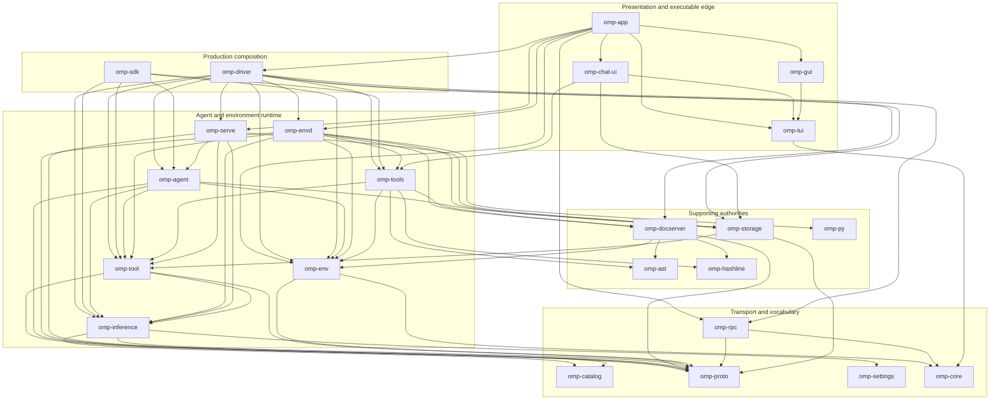
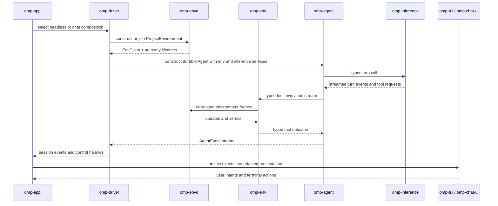

# Workspace crate architecture

The workspace contains 47 crates. `omp-app` is the presentation and executable edge, `omp-driver` is the reusable production composition, and lower crates provide one authority or one vocabulary rather than alternate application stacks. The inventory below is derived from workspace members and normal workspace dependencies reported by `cargo metadata --no-deps`, with purposes checked against each crate's `Cargo.toml` description and README.

## Layering and dependency shape

Arrows in this diagram mean “has a normal Cargo dependency on.” It shows the load-bearing subset; the tables are the complete inventory. Every edge shown is present in the corresponding crate manifest.

The central rules are explicit in `crates/app/README.md`, `crates/driver/README.md`, `crates/env/README.md`, `crates/envd/README.md`, `crates/tool/README.md`, and `crates/tools/README.md`:

1. **Driver composes; app presents.** `omp-driver` assembles sessions, registries, environment bridges, discovery, settings, and orchestration without depending on CLI/TUI/desktop presentation. `omp-app` selects commands and adapts that composition to TUI, print, ACP, RPC, GUI, and daemon surfaces.
2. **One production stack.** Libraries and adapters reuse `omp-driver`; they do not assemble a second combination of agent, inference, environment, and persistence. `omp-sdk` is an embedding facade over the same contracts, not another host.
3. **Client and host remain separate.** `omp-env` owns correlation, guards, endpoint derivation, and typed protocol clients. `omp-envd` owns files, processes, documents, tools, policy, extensions, Python children, and durable runtime resources. See [`processes.md`](processes.md).
4. **Contracts and executors remain separate.** `omp-tool` contains typed revisioned contracts, registry erasure, prompt projection, and argument-stream semantics. `omp-tools` contains resource-owning built-in executors, which run behind the environment boundary.
5. **Transport is not dialect.** `omp-proto`, `omp-rpc`, and `omp-serve` encode, negotiate, and project service boundaries. Canonical inference, thread, tool, storage, and catalog behavior remains in its owning crate; transport crates do not invent provider or application semantics.
6. **Facts flow downward; policy stays with its owner.** `omp-catalog` is capability and route vocabulary, `omp-settings` is reflected configuration, and `omp-core` is shared allocation-conscious data structure support. Executable policy belongs in driver, agent, envd, or the relevant authority—not in those fact crates.

## Crate inventory

“Key dependents” lists representative direct normal workspace dependents, not transitive consumers. Empty means the crate is an executable/acceptance leaf.

### Production stack

| Crate | Purpose | Key dependents |
|---|---|---|
| `omp-app` | Production CLI, daemon, protocol adapters, and presentation boundary; ships the `omp` binary. | `omp-e2e` |
| `omp-driver` | Headless session composition, execution modes, orchestration, discovery, settings, and bridges. | `omp-app` |

The app/driver split is implemented by the command adapters under `crates/app/src` and reusable compositions under `crates/driver/src`; `crates/driver/Cargo.toml` has no dependency on `omp-app`, `omp-chat-ui`, `omp-gui`, or `omp-tui`.

### Environment and source authorities

| Crate | Purpose | Key dependents |
|---|---|---|
| `omp-env` | Resource-free typed client boundary for `omp.env.v1`. | `omp-agent`, `omp-driver`, `omp-envd`, `omp-docserver`, `omp-py`, `omp-sdk`, `omp-tools` |
| `omp-envd` | Live project host for filesystem, process, document, tool, policy, extension, and worker authorities. | `omp-app`, `omp-driver`, `omp-e2e` |
| `omp-docserver` | Local revisioned document, filesystem, transaction, watch, LSP, and DAP authority. | `omp-driver`, `omp-envd`, `omp-sdk`, `omp-tools` |
| `omp-ast` | Tree-sitter language selection, structural search/edit, block resolution, and source summaries. | `omp-agent`, `omp-docserver`, `omp-hashline`, `omp-tools` |
| `omp-walker` | Native filesystem traversal, filtering, globbing, ranking, and file-candidate discovery. | `omp-ast`, `omp-docserver`, `omp-envd`, `omp-grep`, `omp-tools` |
| `omp-hashline` | Disk-free hashline patch parsing and application over immutable byte snapshots. | `omp-app`, `omp-docserver`, `omp-envd`, `omp-tools` |

`omp-docserver` depends on `omp-env` for protocol-facing integration but remains hosted by envd; `omp-ast`, `omp-hashline`, and `omp-walker` provide deterministic library operations rather than opening an alternate project authority (`crates/docserver/README.md`, `crates/hashline/README.md`).

### Agent and inference

| Crate | Purpose | Key dependents |
|---|---|---|
| `omp-agent` | Durable, interruptible, transport-neutral agent-loop foundations. | `omp-app`, `omp-driver`, `omp-envd`, `omp-sdk`, `omp-serve` |
| `omp-inference` | Typed Tower request/response contracts for chat, utilities, media, realtime, discovery, auth, and usage. | `omp-agent`, `omp-driver`, `omp-envd`, `omp-sdk`, `omp-serve`, `omp-tool` |
| `omp-catalog` | Typed provider, route, model, codec, account, capability, and price vocabulary. | `omp-driver`, `omp-envd`, `omp-inference`, `omp-sdk`, `omp-serve`, `omp-tool` |
| `omp-tool` | Typed revisioned tool contracts, deterministic projection, and registry. | `omp-agent`, `omp-driver`, `omp-envd`, `omp-py`, `omp-sdk`, `omp-serve`, `omp-storage`, `omp-tools` |
| `omp-tools` | Resource-owning built-in executors for document, edit, shell, search, eval, and related environment tools. | `omp-app`, `omp-chat-ui`, `omp-driver`, `omp-envd`, `omp-sdk` |

Turn-loop internals are intentionally omitted here; see [`agent-loop.md`](agent-loop.md). Provider and model facts live in `omp-catalog`; the closed operation envelope and Tower service live in `omp-inference`; service projection lives in `omp-serve`.

### Shell

| Crate | Purpose | Key dependents |
|---|---|---|
| `omp-shell` | Batteries-included facade joining the shell engine and builtin registries. | `omp-app`, `omp-e2e` |
| `omp-shell-engine` | Standalone Bash parser and execution engine. | `omp-envd`, `omp-shell`, `omp-shell-builtins`, `omp-tools` |
| `omp-shell-builtins` | In-process command-line utility and process builtins for the OMP shell. | `omp-shell` |

The facade depends on both implementation layers; the engine does not depend back on the facade (`crates/shell/Cargo.toml`, `crates/shell-engine/Cargo.toml`).

### UI and presentation libraries

| Crate | Purpose | Key dependents |
|---|---|---|
| `omp-tui` | Retained-mode terminal DOM, components, rendering, input, and terminal integration. | `omp-app`, `omp-chat-ui`, `omp-gui` |
| `omp-macros` | Proc macros for declarative TUI markup; directory name is `crates/macros`. | `omp-shell-engine`, `omp-tools`, `omp-tui` |
| `omp-tui-vocab` | Canonical markup vocabulary shared by macro lowering and TUI property tables. | `omp-macros`, `omp-tui` |
| `omp-gui` | GPU-accelerated native window host for TUI applications. | `omp-app` |
| `omp-chat-ui` | Host-agnostic chat scene, overlays, ask presentation, and command-facing view model. | `omp-app` |
| `omp-webview` | Embedded browser surfaces backed by system webview or installed browsers. | `omp-envd` |
| `omp-desktop` | Native actor-owned desktop capture, input, and accessibility automation. | `omp-envd` |

`omp-macros` depends only on `omp-tui-vocab`; the runtime `omp-tui` also consumes that vocabulary. Presentation composition stays in app/chat-ui/gui, while world-affecting browser and desktop capabilities are consumed by envd authorities.

### Platform, persistence, and transport

| Crate | Purpose | Key dependents |
|---|---|---|
| `omp-core` | Compact strings/bytes, sparse collections, identities, durations, and binary-to-text primitives. | Most workspace crates |
| `omp-storage` | Append-only transcripts, state indexes, and content-addressed blob storage. | `omp-agent`, `omp-chat-ui`, `omp-collab`, `omp-driver`, `omp-envd`, `omp-py`, `omp-serve` |
| `omp-proto` | Generated protobuf messages and optional Tonic client/server bindings. | `omp-env`, `omp-envd`, `omp-agent`, `omp-inference`, `omp-rpc`, `omp-serve`, `omp-tool`, `omp-tools` |
| `omp-rpc` | gRPC transport/hello/health/TLS/UDS plumbing plus framed stdio embedding protocol. | `omp-app`, `omp-driver`, `omp-e2e` |
| `omp-telemetry` | OpenTelemetry spans, metrics, export, usage observation, and redaction. | `omp-agent`, `omp-app`, `omp-driver`, `omp-envd`, `omp-sdk`, `omp-storage` |
| `omp-settings` | Typed reflected setting schemas and immutable revisioned snapshots. | `omp-app`, `omp-catalog`, `omp-driver`, `omp-envd`, `omp-inference`, `omp-tools` |
| `omp-serve` | Tonic projections for inference, authentication, and blob services. | `omp-app`, `omp-driver`, `omp-e2e` |
| `omp-http` | Shared outbound HTTP pools and TLS policy. | `omp-app`, `omp-driver`, `omp-envd` |
| `omp-sandbox` | Fail-closed native process confinement. | `omp-envd` |
| `omp-oauth` | Provider-independent bounded OAuth protocol primitives. | `omp-envd`, `omp-inference` |
| `omp-secrets` | Secret rules, reversible placeholders, and redaction primitives. | `omp-agent`, `omp-driver`, `omp-envd`, `omp-inference`, `omp-sdk`, `omp-telemetry` |

`omp-proto` generates messages without a system `protoc`; service bindings are feature-gated (`crates/proto/build.rs`). `omp-rpc` is transport and negotiation, while `omp-serve` performs protobuf/domain conversion and injects existing authorities (`crates/rpc/README.md`, `crates/serve/README.md`).

### Python, extensions, and embedding

| Crate | Purpose | Key dependents |
|---|---|---|
| `omp-py` | Self-contained embedded free-threaded CPython runtime with frozen stdlib and project modules. | `omp-app`, `omp-envd`, `omp-tools` |
| `omp-ext` | Extension configuration, dependency resolution, lockfiles, indexes, and trust. | `omp-app`, `omp-driver`, `omp-envd` |
| `omp-sdk` | Stable native embedding facade for sessions, callbacks, discovery, and tools. | `omp-app`, `omp-driver` |

`omp-ext` describes and verifies deployable extension state; live extension processes and authority routing belong to envd. See [`extensions.md`](extensions.md) rather than duplicating those internals here.

### Auxiliary and specialized capabilities

| Crate | Purpose | Key dependents |
|---|---|---|
| `omp-voice` | Cross-platform audio capture, playback, metering, and ownership coordination. | `omp-app`, `omp-envd` |
| `omp-voice-kokoro` | Local Kokoro-82M text-to-speech inference through Candle/Metal. | `omp-inference` |
| `omp-memory` | Durable Mnemopi memory banks, recall, retention, and embedding isolation. | `omp-agent`, `omp-app`, `omp-driver`, `omp-envd`, `omp-tools` |
| `omp-collab` | Bounded encrypted relay and replication substrate for collaboration. | `omp-app`, `omp-driver` |
| `omp-grep` | Synchronous regex/PCRE2 search over memory and workspace files. | `omp-app`, `omp-envd` |
| `omp-ar` | Bounded lazy multi-format archive reading and deterministic archive writing. | `omp-app`, `omp-driver`, `omp-env`, `omp-envd`, `omp-storage`, `omp-tools` |
| `omp-slopjson` | Tolerant parser for malformed, partial, and streaming JSON. | `omp-agent`, `omp-driver`, `omp-inference`, `omp-settings`, `omp-tool`, `omp-tools` |
| `omp-snapcompact` | Pure-Rust bitmap archive renderer used for context compaction. | `omp-agent`, `omp-tui` |
| `omp-scribe` | Prompt template engine and layered property resolution. | `omp-agent`, `omp-app`, `omp-driver`, `omp-py` |
| `omp-e2e` | Executable cross-crate acceptance proofs for the agent mesh. | — |

These crates remain narrow: for example, `omp-grep` delegates traversal to `omp-walker`, `omp-ar` owns archive parsing rather than environment policy, and `omp-voice-kokoro` is reached through `omp-inference` rather than directly from presentation (`crates/grep/README.md`, `crates/ar/README.md`, `crates/inference/Cargo.toml`).

## Crate-level session flow

This is a runtime/control-flow view, not a Cargo dependency graph. It shows composition and the main request/event path without restating turn state mechanics.

`omp-driver` creates or retains `ProjectEnvironment`, inference registry/services, storage, and the agent in `crates/driver/src/headless.rs` and `crates/driver/src/chat.rs`. `omp-agent` calls tools only through `omp-env` (`crates/agent/README.md`). Interactive app adapters translate `AgentEvent` values into chat/TUI presentation (`crates/app/src/chat_cmd.rs`, `crates/app/src/chat_ui.rs`); the retained DOM does not acquire environment authority.

## Key files

| Component | Path |
|---|---|
| Workspace membership and shared dependencies | `Cargo.toml` |
| Production executable and presentation boundary | `crates/app/Cargo.toml` |
| Headless production composition | `crates/driver/Cargo.toml` |
| Durable agent runtime | `crates/agent/Cargo.toml` |
| Environment typed client | `crates/env/Cargo.toml` |
| Environment live host | `crates/envd/Cargo.toml` |
| Document authority | `crates/docserver/Cargo.toml` |
| Inference contracts | `crates/inference/Cargo.toml` |
| Tool contracts | `crates/tool/Cargo.toml` |
| Built-in tool implementations | `crates/tools/Cargo.toml` |
| Retained terminal UI | `crates/tui/Cargo.toml` |
| TUI proc macros | `crates/macros/Cargo.toml` |
| Protobuf definitions and generation | `crates/proto/Cargo.toml` |
| gRPC / stdio transport | `crates/rpc/Cargo.toml` |
| gRPC service projections | `crates/serve/Cargo.toml` |
| Native embedding facade | `crates/sdk/Cargo.toml` |
| Extension configuration and trust | `crates/ext/Cargo.toml` |
| Cross-crate acceptance executable | `crates/e2e/Cargo.toml` |
